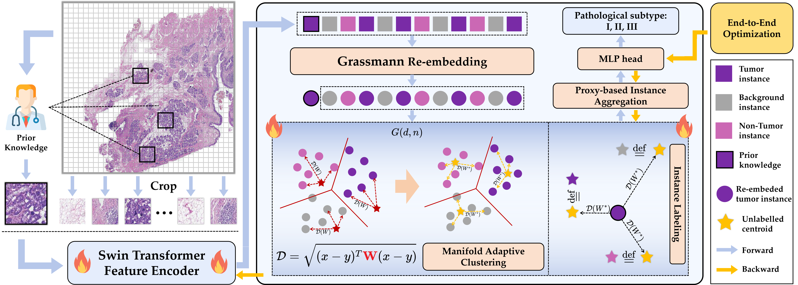

# Multi-instance Mamba Causal Clustering for Pathological Whole-slide Image Classification

## 🤹 Authors [*Corresponding author]
- Pan Huang, _Member_, _IEEE_, Jing Qin*, _Senior Member_, _IEEE_

## :fire: News
- [2025/09/24] Our manuscript was submitted to _IEEE Transactions on Medical Imaging (IF 9.8)_.

## :rocket: Pipeline

Here's an overview of our **Manifold-constrained Adaptive Clustering (MacNet)** method:

Here's some exciting experimental results of both active interpretbility and passive interpretabiity that explain both decision-making process and outcome contribution:

## :mag: TODO
**We are currently organizing all the code. Stay tuned!**
- [x] training code
- [x] Evaluation and Visualization code
- [x] Model code
- [ ] Pretrained weights
